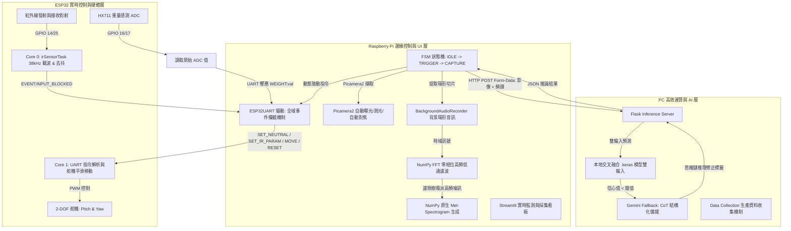

# 🗑️ 智慧垃圾桶系統架構與程式細節全解析 (Smart Trash Bin Architecture & Implementation Details)

這份文件為智慧垃圾桶（Smart Trash Bin）系統提供完整的技術細節、程式邏輯、硬體協定與異常處理機制。本系統採用 **邊緣運算 (Raspberry Pi 節點) + 本地推論與雲端備援 (PC Server) + 實時控制與感測 (ESP32 硬體層)** 的三層分散式協同架構。

---

## 📌 系統全景與資訊流 (Mermaid 資訊拓撲)



---

## 1. ⚙️ ESP32 實時控制與感測層 (C++/Arduino)

ESP32 主要負責**硬體感測（HX711重量、紅外線）**與**2-DOF雲台伺服馬達（Pitch & Yaw）**的控制。程式架構採用 **Dual-Core (雙核心) 異步處理**，保證高頻率、實時硬體訊號不丟失。

### A. 雙核心架構分工
*   **Core 0 (獨立 FreeRTOS 任務 `irSensorTask`)**
    *   負責紅外線對射感測器的調製發射與接收消抖，完全不佔用主程式運行時間。
*   **Core 1 (Arduino `setup()` 與 `loop()`)**
    *   負責主迴圈、UART 串口指令解析、安全時間監測、HX711 讀取與舵機的平滑插值移動。

### B. 紅外線對射消抖與載波機制 (`irSensorTask`)
*   **38kHz 硬體載波與間歇脈衝：** ESP32 使用硬體 PWM 模組 (`ledcAttach` / `ledcWrite`) 產生 **38000 Hz** 的載波訊號驅動發射端 (`IR_TX_PIN = 25`)。為了**防接收端 AGC（自動增益控制）自適應濾除**，發射端每 2 毫秒進行一次開關（Duty Cycle），確保信號呈現高頻脈衝。
*   **雙向狀態去抖動（Double-Sided Software Debouncing）：** 
    *   接收端 (`IR_RX_PIN = 14`) 設為 `INPUT_PULLUP`。
    *   **進入遮擋（`EVENT:INPUT_BLOCKED`）：** 當前為未遮擋時，接收端必須**連續無信號時間超過 `ir_block_debounce_ms` (預設 80ms)**，才判定為真實物理遮擋，藉此濾除飛蟲、震動與粉塵。
    *   **解除遮擋（`EVENT:INPUT_CLEARED`）：** 當前為遮擋時，接收端必須**連續穩定有訊號（期間無任何大於 `ir_gap_threshold_ms` 的中斷）達 `ir_clear_debounce_ms` (預設 200ms)**，才判定為恢復未遮擋，防止垃圾彈跳或人手抽離時造成重複觸發。

### C. 2-DOF 雲台舵機安全控制與移動順序
*   **傾倒移動順序控制 (Dumping Sequence)：**
    *   **頃倒時 (Yaw -> Pitch)：** 先水平旋轉 `Yaw` 到指定分類垃圾桶位置，再垂直旋轉 `Pitch` 頃倒垃圾。這能有效防止垃圾在旋轉過程中被甩飛、潑灑或卡住。
    *   **歸位時 (Pitch -> Yaw)：** 先垂直復位 `Pitch` 回水平面，再水平旋轉 `Yaw` 回中立位置。確保漏斗平台在旋轉時不會碰撞到結構箱體。
*   **角速度平滑限制 (`MAX_ANGULAR_VELOCITY = 200.0`°/s)：** 
    *   透過時間插值 `step_delay = 1000.0 / MAX_ANGULAR_VELOCITY` 逐度控制移動，防止舵機瞬間高速拉扯損壞齒輪，並減少垃圾桶體震動。
*   **安全看門狗 (`MOVEMENT_TIMEOUT_MS = 5000`ms)：**
    *   若舵機處於移動狀態且超過 5 秒未收到重置或到位指令，Core 1 會自動觸發 `return_to_neutral()` 強制平台回水平，避免舵機因卡死而線圈過熱燒毀。

---

## 2. 🍓 Raspberry Pi 邊緣控制層 (Python 邊緣節點)

樹莓派是整個系統的「大腦」，執行有限狀態機 (FSM)、音訊訊號處理、相機控制與 UART 通訊驅動，不跑大型 AI 模型以維持極低能耗與高反應速度。

### A. 有限狀態機 (FSM) 運轉機制 (`composite_trigger_controller.py`)

FSM 在三個狀態之間循環切換：
```
           +--------------------------------------------+
           |                                            |
           v                                            |
      +----------+   重量/動態/IR 觸發                   |
      |   IDLE   | --------------------+                |
      +----------+                     |                |
           ^                           v                | (冷卻結束)
           |                     +-----------+          | (自動歸零 Auto-Tare)
           | (冷卻結束 & 重置)     |  TRIGGER  |          |
           |                     +-----------+          |
           |                           |                |
           |                           | 去抖確認成功    |
           |                           v                |
      +----------+               +-----------+          |
      |   IDLE   | <------------ |  CAPTURE  | ---------+
      +----------+ (冷卻 3s)     +-----------+
```
1.  **`IDLE` (空閒監控)：**
    *   輪詢重量變化公克數（`read_grams()`，門檻 `3.0g`）。
    *   利用 Picamera 進行幀差動態偵測（降採樣至 160x120 並經高斯模糊，門檻 `15%` 像素變化）。
    *   透過串口非阻塞讀取 ESP32 的紅外線事件（`EVENT:INPUT_BLOCKED`）。
2.  **`TRIGGER` (去抖動確認)：**
    *   若為紅外線或影像觸發，去抖動時間（`0.8` 秒）到即直接進入拍照/推論（支持超輕量或無感物體投入）。
    *   若為純重量觸發，去抖動時間後重量必須仍大於門檻，否則判定為假訊號（如地面震動）回退至 `IDLE`。
3.  **`CAPTURE` (拍照/錄音/推論/致動)：**
    *   補錄完成「觸發前 1 秒 + 觸發後 1 秒」的環形背景音訊。
    *   呼叫 Picamera2 強制輸出 JPEG 檔案（繞過 Python 通道轉換，防偏色）。
    *   上傳二進位資料至 PC 推論伺服器。
    *   根據推論類別（`paper`, `plastic`, `metal`, `general`）映射至對應角度，發送 `MOVE` 指令給 ESP32 控制頃倒，並在 1.5 秒後發送 `RESET` 歸位。
    *   跳轉回 `IDLE`，進入 3 秒冷卻期，並標記 `need_auto_tare = True`。

### B. 音訊訊號處理與 NumPy 原生特徵提取
為了在樹莓派上免去安裝複雜龐大的 Librosa 或 PyTorch，系統實現了**純 NumPy 的高品質數位訊號處理 (DSP) 鏈**：
*   **背景環形緩衝區 (`BackgroundAudioRecorder`)：** 透過背景執行緒持續錄製音訊，並寫入 Thread-Safe 的 `AudioBuffer` 環形陣列中。
*   **優選單通道選擇與反相消除：** 在將雙聲道混音為單聲道時，若發現「雙通道平均峰值」比「最大單通道峰值」衰減超過 30%，說明存在反相抵消或單側靜音，系統會**自動拋棄有問題通道，提取優選單通道**。
*   **NumPy FFT 零相位低通濾波器：** 採用 FFT 計算，將高於 `8000Hz` (截止頻率) 的頻譜分量直接抹零，並用逆實數 FFT (`irfft`) 變換回時域。這能**徹底消除樹莓派內部的電磁噪聲與線圈高頻音 (Coil Whine)**。
*   **安全雙閥標準化：** 當音訊峰值高於 `1e-5` (防無聲過度放大) 時，進行自動增益補償（限制最大增益為 `100.0` 倍），使其峰值達安全極限 `0.9`，大幅增強輕量垃圾落地聲。
*   **純 NumPy Mel 濾波器組 (`get_mel_filterbank`) 與 STFT：** 實作 Hanning 窗的短時傅立葉變換，將功率譜與 Mel 濾波器進行矩陣點積，轉為 Mel-spectrogram，最後透過 OpenCV 對應 Viridis 色表縮放為 224x224 的三通道彩色 JPEG 影像位元組。

### C. 序列埠異步多工與 race-condition 攔截機制 (`esp32_uart.py`)
在 UART 通訊中，若 Pi 正在發送主動查詢（如 `GET_WEIGHT` 或 `STATUS`）或控制指令（如 `MOVE`），此時若 ESP32 正好主動上報紅外線事件（`EVENT:INPUT_BLOCKED`），串口緩衝區會將這兩類數據混合。若 Pi 端的讀取程式沒有特殊處理，會將事件誤認為 ACK/DONE，導致**事件丟失與協定解析崩潰**。

*   **全域攔截暫存佇列 (`_shared_pending_events`)：** 
    系統在所有 UART 通訊函數（如 `send_move_command`、`read_response`、`get_ir_status`）的讀取迴圈中，**強制攔截所有以 `EVENT:` 開頭的行，將其 append 到全域共享佇列中**，不作為當前指令的 Response 返回。
*   **非阻塞主動事件消耗 (`check_unsolicited_event`) :** 
    FSM 每次循環會呼叫此函式，它會**優先清空並返回 `_shared_pending_events` 佇列中的攔截事件**，接著非阻塞讀取串口緩衝區，確保主動事件 100% 被捕獲且無任何通訊衝突。

---

## 3. 🖥️ PC 運算層 Inference Server (Python / Flask)

PC 端作為運算核心，執行 Flask 推論伺服器，載入多模態機器學習模型，並在信心度不足時啟動大語言模型 (LLM) 雲端備援判斷。

### A. 交叉融合 (Cross-Fusion) 多模態推論流程
*   推論伺服器 (`app.py`) 同時接收原始 JPEG 影像以及 Mel-spectrogram 頻譜影像。
*   利用 `preprocess_bytes` 將兩者解碼並 resize 為 `(224, 224, 3)`、正規化至 `[0, 1]` 的 float32 張量。
*   將雙輸入送入 TensorFlow `best_multimodal_model.keras` 模型，輸出 4 個垃圾類別（`general`, `plastic`, `paper`, `metal`）的機率分布。

### B. Gemini 雲端備援判定與思維鏈 (CoT) Fallback 結構
當本地交叉融合模型的預測信心值低於設定門檻 `CONFIDENCE_THRESHOLD` (預設 0.50) 時，啟動 `GeminiFallback` 機制：
1.  **結構化思維鏈 (Chain-of-Thought) 提示詞：**
    傳送原始照片至 Gemini API，提示詞強制模型執行結構化推理：
    *   【步驟 1：材質特徵觀察】（反光性、透明度、質地、顏色紋理）
    *   【步驟 2：形狀與結構觀察】（形狀、結構特徵、尺寸）
    *   【步驟 3：分類推理】並給予本地模型的預測與信心度作為參考。
2.  **Pydantic 結構化輸出約束：**
    利用 Google GenAI SDK 啟用結構化輸出 `GenerateContentConfig(response_mime_type="application/json", response_schema=GarbageClassification)`，約束輸出必須是包含 `label`、`confidence` 與 `reasoning` (50字以內推理) 的 JSON。
3.  **優雅降級 (Local Fallback) 網路容錯：**
    若發生 429 配額限制，系統會執行三次指數退避重試；若發生逾時、斷網或 API 金鑰失效，會自動**降級回退採用本地模型的原始結果**，確保系統絕不斷線卡死。

### C. 備援修正機率重新分配算法
當 Gemini 修正了本地模型的預測類別（例如將本地的 `general` 修正為 `paper`）並給予新信心值 $C_{gemini}$ 後，為了維持完整的四類機率分布以供 Streamlit 看板呈現，系統採用以下算法：
$$P_{final}(Class) = \begin{cases} C_{gemini}, & \text{if } Class = Label_{gemini} \\ (1.0 - C_{gemini}) \times \frac{P_{local}(Class)}{\sum_{c \neq Label_{gemini}} P_{local}(c)}, & \text{if } Class \neq Label_{gemini} \end{cases}$$
這保證了**預測類別機率符合 Gemini 的判定，其餘類別機率則依本地模型的預測比例等比縮放**，維持數據的合理連續性。

### D. 生產資料收集機制 (Data Collection)
若 `.env` 中設定 `DATA_COLLECTION=true`，推論成功後會異步將本次推論的原始影像（`_img.jpg`）、Mel-spectrogram二進位數據（`_aud.bin`）以及包含最終預測標籤、信心度、是否啟用 Gemini 的 JSON 元數據（`_meta.json`）寫入 `data/raw/{label}/`。
*   *提示：其中 `is_gemini=true` 的樣本標籤品質極高，是後續離線增量訓練的優選黃金數據集。*

---

## 4. 📊 Streamlit 實時監測看板 (`Streamlit.py`)

利用 Streamlit 打造的高科技感、深色調 UI 監測站，提供五大核心功能：
1.  **垃圾桶運行監控：** 自動每 2 秒輪詢 `monitor_state.json`。即時呈現當前 FSM 狀態、漏斗重量增量、連線狀態、上次投遞照片、Mel-spectrogram 圖，並可實時播放落地碰撞錄音。
2.  **麥克風收訊診斷：** 提供手動收音測試，自動繪製時域波形與播放 WAV。在非實體設備（如開發機）上，會自動啟用高品質**模擬碰撞聲生成器**，支持零硬體調試。
3.  **採集 Dataset 工具：** 實施人工交互標記。標記人員可檢視最新一次投遞的暫存多媒體檔案，一鍵將其分類歸檔至對應的數據集目錄下並生成 UUID，同時附帶「撤銷上一次標記」防呆機制。
4.  **網路與 Tailscale 設定：** 即時展示與診斷與 PC 推論伺服器的 Ping 延遲與 Tailscale 虛擬 IP 位址。
5.  **舵機與重量硬體調校：** 支持手動調控平台 `PITCH_NEUTRAL` 偏置角，並將參數儲存至 `.env` 中供主程序實時重載，達到免重啟校正平台水平的目的。

---

## 💡 面試/答詢黃金問答彙整 (Q&A Cheatsheet)

### Q1: 為什麼音訊處理要自己用 NumPy 寫，而不用 Librosa 庫？
> **回答要點：**
> Librosa 依賴於 `scipy`, `numba`, `llvmlite` 等大型 C/C++ 編譯庫，在樹莓派等邊緣嵌入式環境上極難安裝且載入速度慢（通常需 4~6 秒）。
> 我們利用 NumPy 矩陣乘法純手寫 **STFT (短時傅立葉變換)** 與 **Mel Filterbank (美爾濾波矩陣)**，執行時間縮短至 **毫秒級**，且安裝包大小減少了 95% 以上，達到輕量化邊緣運算的目的。

### Q2: 紅外線對射感測器如何避免陽光或室內環境光線的干擾？
> **回答要點：**
> 我們沒有採用靜態紅外線讀取，而是使用 ESP32 硬體 PWM 產生 **38kHz 的脈衝載波**（這與家用冷氣遙控器防干擾原理相同）。
> 紅外線接收頭內建硬體帶通濾波器，只對 38kHz 的紅外光敏感，因此能 100% 濾除太陽光、日光燈等環境雜散光。同時，在 Core 0 採用異步消抖計算法，能保證垃圾快速通過時訊號被精確捕獲。

### Q3: 既然有重量感測器，為什麼還需要影像幀差？這兩者是如何融合的？
> **回答要點：**
> 這是為了解決**單一感測器的盲區**：
> 1. 重量感測器對極輕物體（如一張乾淨紙屑、一小張塑膠膜）可能低於 3g 門檻而不易觸發。
> 2. 影像偵測在光影劇烈漂移或垃圾桶晃動時容易誤觸發。
> 
> 在 FSM 中，我們採用**多通道異步觸發去抖機制**：紅外線、重量、畫面任何一個觸發後都會進入去抖狀態。如果觸發源包含影像或紅外線，說明有物理位移，去抖結束後直接判定投遞成功；若僅有重量觸發，去抖後重量必須維持大於 3g，保證了「輕量物體可偵測，重物撞擊震動不誤判」的極佳體驗。

### Q4: 本地模型跟雲端 Gemini 之間是怎麼分工的？
> **回答要點：**
> 本地模型是採用輕量化的多模態交叉融合模型，速度極快（延遲 < 50ms），但對極其複雜或形變嚴重的垃圾，信心值可能偏低。
> 我們設置了 **「雙軌決策機制」**：信心值高於 50% 時直接採用本地快速分類；信心值低於 50% 時，PC 伺服器會異步調用雲端 Gemini 進行 Chain-of-Thought 思維鏈推理，在 1 秒左右完成高精度的雲端修正。若斷網或 Gemini 失敗，則自動降級使用本地模型，保證了**速度、精度與可用性**的最佳平衡。
